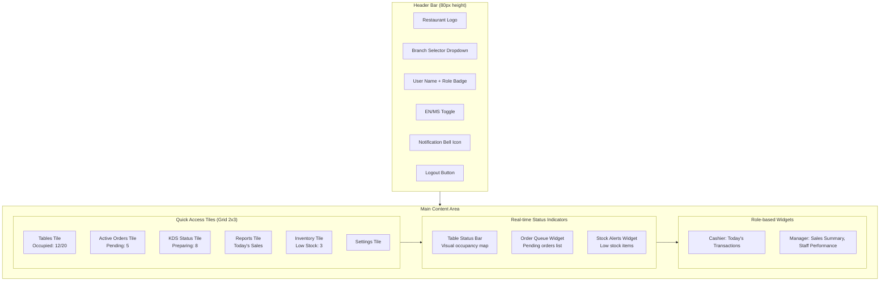
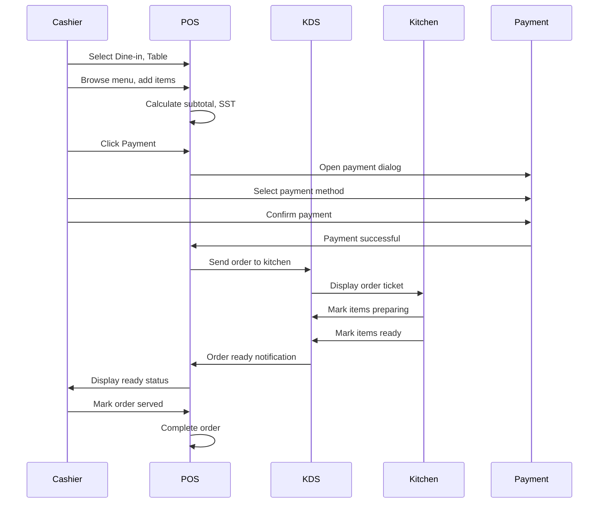
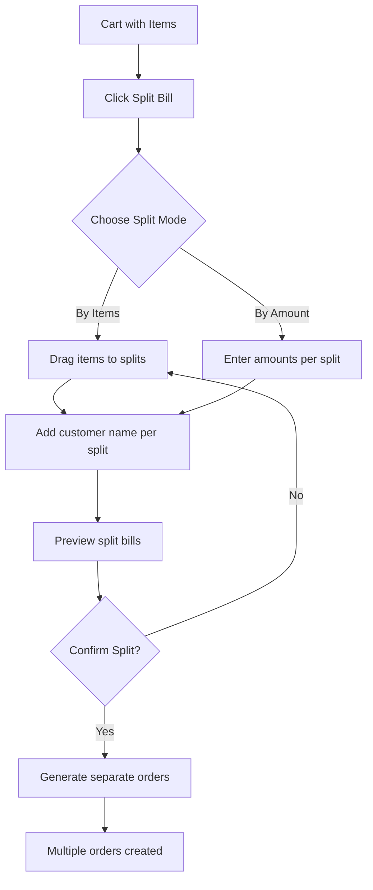
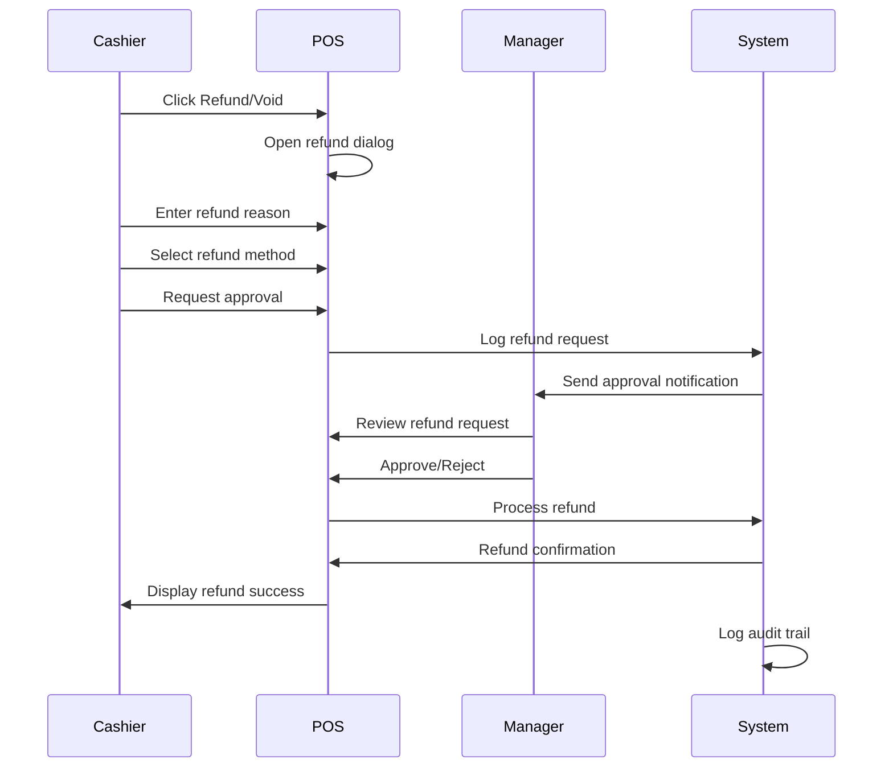

# POS UI Wireframe Design Plan

## 1. Design Framework & Principles

### 1.1 RTCROS Framework Application

**Role**: Senior UI Developer specializing in POS systems

**Task**: Design intuitive, efficient, audit-friendly UI wireframes

**Context**: Malaysia restaurant operations (multi-branch, SST compliance, halal requirements)

**Requirements**: Dashboard, Order Entry, Payment, KDS, Inventory Alerts, Reports

**Output**: Wireframe descriptions, component library, interaction flows, style guide

**Standard**: Material Design / Angular best practices, responsive, accessible, audit-friendly

### 1.2 Design Principles

- **Efficiency First**: Minimize clicks, maximize speed for high-volume operations
- **Audit Trail**: Every action logged with user/role/timestamp
- **Accessibility**: WCAG 2.1 AA compliance, keyboard navigation, screen reader support
- **Responsive**: Desktop (1920x1080) and tablet (1024x768) optimized
- **Multilingual**: Seamless EN/MS toggle without layout shift
- **Malaysia-Specific**: SST display, halal badges, MYR currency formatting

## 2. Component Library Specifications

### 2.1 Buttons

**Primary Button**

- Style: Raised, solid background (#4CAF50 for halal/positive actions)
- Size: 48px height (touch-friendly)
- States: Default, Hover, Active, Disabled, Loading
- Icon: Optional left icon (Material Icons)
- Accessibility: ARIA label, keyboard focus indicator

**Secondary Button**

- Style: Outlined, transparent background
- Size: 48px height
- Use: Cancel, back actions

**Icon Button**

- Style: Circular, 40px diameter
- Use: Quick actions (search, filter, settings)

**Action Button (FAB)**

- Style: Floating, circular, 56px diameter
- Position: Fixed bottom-right
- Use: Quick add item, emergency actions

### 2.2 Modals & Dialogs

**Confirmation Dialog**

- Size: 400px width, auto height
- Components: Title, message, icon, action buttons
- Audit: Logs all confirmations with user/timestamp

**Payment Dialog**

- Size: 600px width, 500px height
- Components: Payment method selector, amount input, receipt preview
- Features: Real-time SST calculation, change calculation

**Modifier Dialog**

- Size: 700px width, 600px height
- Components: Item image, variant selector, modifier checkboxes, special instructions
- Features: Real-time price update, required field validation

### 2.3 Tables & Lists

**Data Table (PrimeNG p-table)**

- Features: Sortable columns, pagination, row selection
- Responsive: Horizontal scroll on mobile
- Accessibility: ARIA labels, keyboard navigation

**Order List**

- Layout: Card-based for better visual hierarchy
- Information: Order number, table, items, status, timestamp
- Actions: Quick status update buttons

### 2.4 Alerts & Notifications

**Toast Notification**

- Position: Top-right corner
- Duration: 5 seconds (configurable)
- Types: Success (green), Warning (orange), Error (red), Info (blue)
- Accessibility: ARIA live region

**Alert Banner**

- Position: Top of screen, below header
- Types: Low stock, system maintenance, offline mode
- Dismissible: Yes, with close button

**Badge Indicators**

- Size: 20px diameter
- Colors: Red (critical), Orange (warning), Green (success)
- Position: Top-right of icon/element

### 2.5 Search Bar

**Search Input**

- Style: Outlined text field with search icon
- Features: Auto-complete, debounced search (300ms)
- Keyboard: Enter to search, Escape to clear
- Accessibility: ARIA label "Search menu items"

### 2.6 Dropdowns & Selectors

**Select Dropdown (PrimeNG p-dropdown)**

- Style: Outlined, 48px height
- Features: Searchable, multi-select option
- Accessibility: Keyboard navigation, ARIA expanded state

**Category Tabs**

- Style: Horizontal tabs with underline indicator
- Responsive: Scrollable on mobile
- Active state: Bold text, accent color underline

## 3. Screen Wireframes

### 3.1 Dashboard Screen

#### 3.1.1 Layout Structure



#### 3.1.2 Detailed Specifications

**Header Bar**

- Height: 80px
- Background: #FFFFFF
- Components:
  - Logo (left): 120px width, restaurant branding
  - Branch Selector (left): Dropdown showing current branch, branch code
  - User Info (right): Avatar + name + role badge (color-coded)
  - Language Toggle (right): EN/MS switch button
  - Notifications (right): Bell icon with badge count
  - Logout (right): Icon button

**Quick Access Tiles**

- Layout: CSS Grid, 2 columns x 3 rows (responsive: 1 column on tablet)
- Tile Size: 280px x 180px
- Spacing: 16px gap
- Design: Card with shadow, hover effect
- Content:
  - Icon (top): 48px, Material Icon
  - Title: 18px, bold
  - Metric: 32px, large number
  - Status indicator: Color dot (green/yellow/red)
- Click Action: Navigate to respective screen

**Table Status Bar**

- Layout: Horizontal bar with table indicators
- Table Indicator: 40px circle
  - Green: Available
  - Yellow: Occupied
  - Red: Needs attention
- Hover: Tooltip with table number and order details

**Order Queue Widget**

- Layout: Vertical list, max 5 items
- Item: Order number, table, items count, time since order
- Color coding: Yellow (pending), Blue (preparing), Green (ready)
- Click: Navigate to order details

**Stock Alerts Widget**

- Layout: List of low stock items
- Item: Item name, current stock, min threshold
- Alert level: Red (critical < 10%), Orange (warning < 25%)
- Click: Navigate to inventory management

**Role-based Widgets**

- Cashier Widget: Today's transaction count, total revenue
- Manager Widget: Sales summary chart, staff performance metrics
- Conditional rendering based on user role

#### 3.1.3 Accessibility Features

- Skip link to main content
- ARIA landmarks: `<header>`, `<main>`, `<nav>`
- Keyboard navigation: Tab through tiles, Enter to activate
- Screen reader: Announce tile content and metrics
- High contrast mode support

### 3.2 Order Entry Screen

#### 3.2.1 Layout Structure

```mermaid
flowchart LR
    subgraph Header["Header (60px)"]
        BackBtn[Back Button]
        ScreenTitle[Order Entry]
        OrderType[Order Type: Dine-in/Takeaway/Delivery]
        TableSelector[Table Selector]
        SearchBar[Search Menu Items]
    end
    
    subgraph MainLayout["3-Panel Layout"]
        subgraph LeftPanel["Left Panel (300px) - Menu Categories"]
            CategoryTabs[Category Tabs<br/>Food | Drinks | Specials]
            CategoryList[Category List<br/>- Main Course<br/>- Appetizers<br/>- Desserts]
        end
        
        subgraph CenterPanel["Center Panel (Flex) - Menu Items"]
            ItemGrid[Menu Item Grid<br/>Card Layout 3 columns]
            ItemCard[Item Card<br/>Image | Name | Price<br/>Halal Badge | Spice Level]
            Pagination[Pagination Controls]
        end
        
        subgraph RightPanel["Right Panel (400px) - Order Cart"]
            CartHeader[Cart Header<br/>Order # | Table #]
            CartItems[Cart Items List<br/>Item | Qty | Price | Actions]
            CartSummary[Cart Summary<br/>Subtotal | SST | Total]
            ActionButtons[Action Buttons<br/>Split Bill | Payment | Clear]
        end
    end
    
    Header --> MainLayout
    LeftPanel --> CenterPanel
    CenterPanel --> RightPanel
```

#### 3.2.2 Detailed Specifications

**Header Section**

- Height: 60px
- Components:
  - Back button: Icon button, navigates to dashboard
  - Screen title: "Order Entry" (i18n)
  - Order type selector: Toggle buttons (Dine-in/Takeaway/Delivery)
  - Table selector: Dropdown (only for dine-in), shows available tables
  - Search bar: Full-width search input with icon

**Left Panel - Menu Categories**

- Width: 300px (fixed)
- Background: #F5F5F5
- Category Tabs:
  - Horizontal tabs with underline indicator
  - Active: Bold, accent color (#4CAF50)
  - Scrollable if many categories
- Category List:
  - Vertical list of categories
  - Each item: Icon + name (i18n)
  - Active: Highlighted background
  - Click: Filter menu items

**Center Panel - Menu Items Grid**

- Layout: CSS Grid, 3 columns (responsive: 2 on tablet, 1 on mobile)
- Gap: 16px
- Item Card:
  - Size: 200px x 280px
  - Image: 200px x 150px, aspect ratio 4:3
  - Name: 16px, bold, i18n (EN/MS)
  - Price: 18px, bold, MYR format (RM 12.50)
  - Halal badge: Green badge with "HALAL" text
  - Spice level: 5-star indicator (0-5)
  - Out of stock: Red overlay with "Out of Stock" text
  - Quick add button: "+" icon button, bottom-right
- Pagination: Bottom of grid, PrimeNG paginator

**Right Panel - Order Cart**

- Width: 400px (fixed)
- Background: #FFFFFF
- Cart Header:
  - Order number: Auto-generated (ORD-2024-001234)
  - Table number: Display if dine-in
  - Customer name: Optional input field
- Cart Items List:
  - Scrollable list (max height: 400px)
  - Item row:
    - Item name (i18n)
    - Quantity: Number input with +/- buttons
    - Unit price: MYR format
    - Subtotal: Quantity × unit price
    - Actions: Edit (modifier dialog), Remove
    - Variants/modifiers: Display below item name
- Cart Summary:
  - Subtotal: Sum of all items
  - SST (6%): Calculated on applicable items
  - Total: Subtotal + SST
  - All amounts in MYR format (RM XX.XX)
- Action Buttons:
  - Split Bill: Opens split bill dialog
  - Payment: Opens payment dialog
  - Clear: Clears entire cart (with confirmation)

#### 3.2.3 Modifier Dialog Specifications

**Layout**

- Size: 700px width × 600px height
- Modal overlay: Semi-transparent black (#000000, 50% opacity)

**Components**

- Header:
  - Item image: 200px × 150px
  - Item name: 20px, bold
  - Base price: 18px, MYR format
- Variant Selection:
  - Radio button group for size variants
  - Each option: Name, price modifier (+RM X.XX)
  - Default variant pre-selected
- Modifier Selection:
  - Checkboxes for optional modifiers
  - Required modifiers: Radio buttons (single selection)
  - Each modifier: Name, price modifier
  - Max selections indicator (if applicable)
- Special Instructions:
  - Textarea, 3 rows
  - Placeholder: "Special instructions (optional)"
- Footer:
  - Cancel button (secondary)
  - Add to Cart button (primary)
  - Price preview: Updated total with modifiers

#### 3.2.4 Split Bill Dialog Specifications

**Layout**

- Size: 800px width × 600px height

**Components**

- Split Options:
  - Toggle: "By Items" or "By Amount"
- By Items Mode:
  - Drag-and-drop interface
  - Left: Original order items
  - Right: Split bills (Bill 1, Bill 2, etc.)
  - Customer name input per split
- By Amount Mode:
  - Amount input fields per split
  - Auto-distribute remaining amount
- Preview:
  - Each split shows: Items, subtotal, SST, total
- Actions:
  - Add Split (creates new split)
  - Remove Split
  - Confirm Split (generates separate orders)

#### 3.2.5 Interaction Flows

**Dine-in Order Lifecycle**

1. Select "Dine-in" order type
2. Select table from dropdown
3. Browse menu categories (left panel)
4. Click menu item card (center panel)
5. Modifier dialog opens
6. Select variants/modifiers, add special instructions
7. Click "Add to Cart"
8. Item appears in cart (right panel)
9. Repeat steps 4-8 for additional items
10. Review cart summary
11. Click "Payment" button
12. Payment dialog opens (see Payment Screen)
13. Process payment
14. Order sent to kitchen (KDS)
15. Receipt generated

**Quick Add Flow**

1. Hover over menu item card
2. Click "+" quick add button
3. Item added with default variants (no dialog)
4. Item appears in cart

**Edit Item Flow**

1. Click "Edit" button on cart item
2. Modifier dialog opens with current selections
3. Modify variants/modifiers
4. Click "Update"
5. Cart item updated

#### 3.2.6 Accessibility Features

- Keyboard navigation: Tab through categories, items, cart
- Screen reader: Announce item details, cart updates
- ARIA labels: All buttons, inputs, cards
- Focus management: Focus returns to cart after adding item
- High contrast: All text meets WCAG contrast ratios

### 3.3 Payment Screen

#### 3.3.1 Layout Structure

```mermaid
flowchart TB
    subgraph PaymentDialog["Payment Dialog (600px × 500px)"]
        subgraph Header["Header"]
            Title[Payment]
            OrderInfo[Order #ORD-2024-001234<br/>Table #5]
        end
        
        subgraph PaymentMethod["Payment Method Selection"]
            CashBtn[Cash Button]
            TnGBtn[TnG eWallet Button]
            CardBtn[Card Button]
        end
        
        subgraph AmountSection["Amount Section"]
            TotalAmount[Total Amount: RM 26.50]
            AmountInput[Amount Received Input]
            ChangeDisplay[Change: RM 3.50]
        end
        
        subgraph ReceiptPreview["Receipt Preview"]
            ReceiptItems[Itemized Receipt<br/>Items | Qty | Price]
            ReceiptSummary[Subtotal | SST | Total]
        end
        
        subgraph Actions["Action Buttons"]
            CancelBtn[Cancel]
            RefundBtn[Refund/Void]
            ConfirmBtn[Confirm Payment]
        end
    end
```

#### 3.3.2 Detailed Specifications

**Payment Dialog**

- Size: 600px width × 500px height
- Modal: Centered, overlay background

**Header**

- Title: "Payment" (i18n)
- Order info: Order number, table number (if dine-in)
- Close button: X icon, top-right

**Payment Method Selection**

- Layout: 3 large buttons in row
- Button size: 180px × 80px
- Icons: Material Icons (cash, wallet, credit_card)
- Selected state: Accent border, highlighted background
- Payment methods:
  - Cash: Direct payment
  - Touch 'n Go eWallet: Opens TnG payment flow
  - Card: Card payment (if enabled)

**Amount Section**

- Total Amount:
  - Label: "Total Amount"
  - Value: Large text, 32px, bold, MYR format
- Amount Received (Cash only):
  - Input field: Number input, 48px height
  - Placeholder: "Enter amount received"
  - Auto-focus when Cash selected
- Change Display:
  - Label: "Change"
  - Value: Large text, green color if positive
  - Hidden if amount received < total

**Receipt Preview**

- Layout: Scrollable list, max height 200px
- Item row:
  - Item name (i18n)
  - Quantity
  - Unit price
  - Subtotal
- Summary:
  - Subtotal: Sum of items
  - SST (6%): Calculated amount, itemized
  - Total: Bold, large text
- Format: Print-ready format

**Action Buttons**

- Cancel: Secondary button, closes dialog
- Refund/Void: Warning button (orange), requires manager approval
- Confirm Payment: Primary button (green), processes payment

#### 3.3.3 Refund/Void Flow

**Refund Dialog**

- Size: 500px × 400px
- Components:
  - Refund reason: Dropdown (Customer request, Item unavailable, etc.)
  - Refund amount: Auto-filled, editable
  - Refund method: Radio buttons (Original method, Cash, Store credit)
  - Manager approval: Required checkbox
  - Notes: Textarea for additional info
- Actions:
  - Cancel
  - Request Approval (sends to manager)
  - Process Refund (if manager)

**Audit Trail**

- All refunds logged with:
  - User ID and role
  - Timestamp
  - Refund reason
  - Manager approval (if required)
  - Original payment details

#### 3.3.4 Touch 'n Go eWallet Integration

**TnG Payment Flow**

1. User selects "TnG eWallet" button
2. System generates payment request
3. QR code displayed in dialog
4. Customer scans QR code with TnG app
5. Payment confirmation received
6. Dialog shows "Payment Successful"
7. Receipt generated

**TnG Dialog Components**

- QR Code: 200px × 200px, centered
- Instructions: "Scan with Touch 'n Go app"
- Status: "Waiting for payment..." → "Payment confirmed"
- Cancel: Cancel payment button

#### 3.3.5 Accessibility Features

- Keyboard navigation: Tab through payment methods, amount input
- Screen reader: Announce payment method selection, amount calculations
- ARIA labels: All buttons, inputs
- Error states: Visual and auditory feedback for invalid amounts
- Focus management: Focus on amount input when Cash selected

### 3.4 Kitchen Display System (KDS) Screen

#### 3.4.1 Layout Structure

```mermaid
flowchart TB
    subgraph KDSHeader["KDS Header (60px)"]
        StationFilter[Station Filter Tabs<br/>Hot Kitchen | Cold Kitchen | Drinks]
        StatusFilter[Status Filter<br/>All | Pending | Preparing | Ready]
        SettingsBtn[Settings Button]
    end
    
    subgraph KDSMain["Main Display Area (Grid Layout)"]
        subgraph OrderTickets["Order Tickets (Flex Grid)"]
            Ticket1[Order Ticket 1<br/>Status: Preparing<br/>Aging: 5:30<br/>Items List]
            Ticket2[Order Ticket 2<br/>Status: Ready<br/>Aging: 8:15<br/>Items List]
            Ticket3[Order Ticket 3<br/>Status: Pending<br/>Aging: 0:45<br/>Items List]
        end
    end
    
    subgraph KDSFooter["Footer (40px)"]
        TotalOrders[Total Orders: 12]
        AutoRefresh[Auto-refresh: ON]
        SoundToggle[Sound Alerts: ON]
    end
```

#### 3.4.2 Detailed Specifications

**Header Section**

- Height: 60px
- Background: #263238 (dark theme for kitchen environment)
- Station Filter Tabs:
  - Horizontal tabs: Hot Kitchen, Cold Kitchen, Drinks, Dessert
  - Active: Accent color (#4CAF50), bold
  - Click: Filters orders by prep station
- Status Filter:
  - Dropdown: All, Pending, Preparing, Ready, On Hold
  - Click: Filters orders by status
- Settings Button: Icon button, opens KDS settings

**Order Ticket Card**

- Size: 320px width × 400px height (responsive grid)
- Layout: Card with shadow
- Color Coding:
  - Pending: Yellow border (#FFC107)
  - Preparing: Blue border (#2196F3)
  - Ready: Green border (#4CAF50)
  - On Hold: Gray border (#9E9E9E)
- Header:
  - Order number: Large text, bold (ORD-2024-001234)
  - Table number: Badge (Table #5)
  - Order type: Badge (Dine-in/Takeaway/Delivery)
  - Status: Color-coded badge
- Aging Timer:
  - Display: "Aging: 5:30" (minutes:seconds)
  - Color: Red if exceeds SLA
  - Updates every second
- Prep SLA:
  - Display: "SLA: 15 min" (item-specific)
  - Progress bar: Visual countdown
  - Alert: Red if exceeded
- Items List:
  - Scrollable list
  - Item row:
    - Item name (i18n)
    - Quantity: Badge
    - Prep station: Icon
    - Special instructions: Highlighted if present
    - Status buttons: Start, Ready, Hold
- Priority Indicator:
  - High priority: Red flag icon
  - Normal: No indicator
- Actions:
  - Bump Order: Increases priority
  - Hold Order: Puts on hold with reason
  - Mark Ready: Updates item/order status

**Footer Section**

- Height: 40px
- Background: #37474F
- Components:
  - Total Orders: Count of visible orders
  - Auto-refresh: Toggle switch, 5-second interval
  - Sound Alerts: Toggle switch for audio notifications

#### 3.4.3 KDS Settings Dialog

**Layout**

- Size: 600px × 500px

**Settings Options**

- Display Mode:
  - Toggle: Digital Display / Printer Mode
- Printer Configuration:
  - IP Address input
  - Port input
  - Test Print button
- Display Preferences:
  - Auto-refresh interval: Slider (1-10 seconds)
  - Sound alerts: Toggle
  - Alert volume: Slider
- Station Assignment:
  - Current station: Dropdown
  - Available stations: List
- Access: Manager/Admin only

#### 3.4.4 Real-time Updates

**SignalR Integration**

- New order: Ticket appears with animation
- Status update: Ticket border color changes
- Item ready: Item row highlights green
- Sound alert: Plays notification sound (if enabled)

**Update Frequency**

- Auto-refresh: 5 seconds (configurable)
- Manual refresh: Refresh button in header
- Real-time: SignalR push notifications

#### 3.4.5 Accessibility Features

- High contrast mode: Dark theme with high contrast
- Keyboard navigation: Arrow keys to navigate tickets
- Screen reader: Announce new orders, status changes
- Visual indicators: Color + text (not color alone)
- Focus management: Focus on new orders

### 3.5 Inventory Alerts Screen

#### 3.5.1 Alert Types

**Low Stock Alert**

- Trigger: Current stock < min threshold
- Display: Banner at top of screen, toast notification
- Components:
  - Item name (i18n)
  - Current stock: Number with unit
  - Min threshold: Number with unit
  - Alert level: Critical (< 10%) or Warning (< 25%)
  - Action: "Restock" button (navigates to inventory)

**Critical Stock Alert**

- Trigger: Current stock = 0 or < 5% of min threshold
- Display: Modal dialog (cannot be dismissed)
- Components:
  - Warning icon (red)
  - Item name
  - Current stock: "0" or very low number
  - Urgency: "CRITICAL - Immediate action required"
  - Actions:
    - Restock Now (navigates to inventory)
    - Mark Out of Stock (updates menu item)

#### 3.5.2 Alert Widget (Dashboard)

**Layout**

- Size: 300px × 200px
- Position: Dashboard, bottom-right

**Components**

- Header: "Stock Alerts" (i18n)
- Alert List:
  - Scrollable list, max 5 items
  - Item row:
    - Item name
    - Current stock / Min threshold
    - Alert level indicator (red/orange dot)
    - Time since alert
- Footer:
  - "View All" link (navigates to inventory management)
  - Alert count badge

#### 3.5.3 Alert Notification Flow

1. System detects low stock
2. Alert created in database
3. Real-time notification sent (SignalR)
4. Toast notification appears (top-right)
5. Alert banner appears (if critical)
6. Alert widget updates (dashboard)
7. User acknowledges or takes action
8. Alert dismissed or resolved

### 3.6 Reports Screen

#### 3.6.1 Layout Structure

```mermaid
flowchart TB
    subgraph ReportsHeader["Header (60px)"]
        ReportType[Report Type Selector<br/>Sales | Items | Prep Times | Inventory]
        DateRange[Date Range Picker<br/>Today | Week | Month | Custom]
        ExportBtn[Export Button<br/>CSV | PDF]
    end
    
    subgraph ReportsMain["Main Content"]
        subgraph Filters["Filters Panel (Left, 250px)"]
            BranchFilter[Branch Filter]
            CategoryFilter[Category Filter]
            StatusFilter[Status Filter]
            ApplyBtn[Apply Filters]
        end
        
        subgraph ReportContent["Report Content (Flex)"]
            SummaryCards[Summary Cards<br/>Total Revenue | Orders | Avg Order Value]
            ChartArea[Charts Area<br/>Line/Bar Charts]
            DataTable[Data Table<br/>Detailed Data]
        end
    end
```

#### 3.6.2 Detailed Specifications

**Header Section**

- Height: 60px
- Report Type Selector:
  - Tabs: Sales, Items, Prep Times, Inventory, Staff Performance
  - Active: Accent color, bold
- Date Range Picker:
  - Quick options: Today, Yesterday, This Week, This Month, Custom
  - Custom: Date range picker (from/to dates)
- Export Button:
  - Dropdown: Export as CSV, Export as PDF
  - Icon: Download icon

**Filters Panel**

- Width: 250px (collapsible)
- Background: #F5F5F5
- Filters:
  - Branch: Multi-select dropdown
  - Category: Multi-select dropdown
  - Order Status: Checkboxes
  - Payment Method: Checkboxes
- Apply Button: Primary button, applies filters
- Reset Button: Clears all filters

**Summary Cards**

- Layout: 3 cards in row
- Card 1: Total Revenue
  - Value: Large text, MYR format
  - Change: Percentage vs previous period
  - Icon: Currency icon
- Card 2: Total Orders
  - Value: Large number
  - Change: Count vs previous period
  - Icon: Shopping cart icon
- Card 3: Average Order Value
  - Value: MYR format
  - Change: Percentage vs previous period
  - Icon: Chart icon

**Charts Area**

- Chart Types:
  - Sales Report: Line chart (revenue over time)
  - Items Report: Bar chart (top items by quantity/revenue)
  - Prep Times: Bar chart (average prep time by station)
- Chart Library: PrimeNG Charts (Chart.js)
- Interactive: Hover for details, click to filter
- Responsive: Adapts to screen size

**Data Table**

- Component: PrimeNG p-table
- Features:
  - Sortable columns
  - Pagination (20 items per page)
  - Row selection
  - Export functionality
- Columns (Sales Report):
  - Date
  - Order Number
  - Order Type
  - Items
  - Subtotal
  - SST
  - Total
  - Payment Method
  - Status

#### 3.6.3 Report Types

**Daily Sales Report**

- Summary: Total revenue, order count, average order value
- Breakdown: By hour, by order type, by payment method
- Charts: Revenue trend, order count trend
- Table: Detailed order list

**Item Performance Report**

- Summary: Top items by quantity, top items by revenue
- Breakdown: By category, by time period
- Charts: Bar chart (top 10 items)
- Table: Item details with quantities sold

**Prep Times Report**

- Summary: Average prep time, on-time percentage
- Breakdown: By station, by item, by hour
- Charts: Prep time by station, prep time trend
- Table: Order prep time details

**Inventory Report**

- Summary: Total stock value, low stock count
- Breakdown: By category, by supplier
- Charts: Stock level trends
- Table: Inventory items with stock levels

#### 3.6.4 Export Functionality

**CSV Export**

- Format: Comma-separated values
- Includes: All filtered data
- Headers: Column names (i18n)
- File name: `ReportName_YYYY-MM-DD.csv`

**PDF Export**

- Format: A4 portrait
- Includes: Summary, charts, data table
- Header: Restaurant name, branch, report type, date range
- Footer: Generated timestamp, user name
- File name: `ReportName_YYYY-MM-DD.pdf`

#### 3.6.5 Accessibility Features

- Keyboard navigation: Tab through filters, charts, table
- Screen reader: Announce summary metrics, chart data
- ARIA labels: All interactive elements
- Data table: Full keyboard navigation support
- Export: Accessible download links

## 4. Style Guide

### 4.1 Color Palette

**Primary Colors**

- Primary Green: #4CAF50 (halal badges, positive actions)
- Primary Blue: #2196F3 (information, links)
- Primary Red: #F44336 (alerts, errors, critical)
- Primary Orange: #FF9800 (warnings, refunds)

**Neutral Colors**

- Background: #FFFFFF (main), #F5F5F5 (panels)
- Text Primary: #212121 (headings, body)
- Text Secondary: #757575 (labels, hints)
- Border: #E0E0E0 (dividers, borders)
- Shadow: rgba(0, 0, 0, 0.1) (card shadows)

**Status Colors**

- Success: #4CAF50 (green)
- Warning: #FF9800 (orange)
- Error: #F44336 (red)
- Info: #2196F3 (blue)

**KDS Theme (Dark)**

- Background: #263238
- Surface: #37474F
- Text: #FFFFFF
- Accent: #4CAF50

### 4.2 Typography

**Font Family**

- Primary: Roboto (Google Fonts)
- Fallback: 'Segoe UI', Arial, sans-serif

**Font Sizes**

- H1: 32px, bold (screen titles)
- H2: 24px, bold (section headers)
- H3: 20px, bold (subsection headers)
- Body: 16px, regular (default text)
- Small: 14px, regular (labels, hints)
- Caption: 12px, regular (metadata)

**Font Weights**

- Regular: 400
- Medium: 500
- Bold: 700

**Line Heights**

- Headings: 1.2
- Body: 1.5

### 4.3 Spacing

**Grid System**

- Base unit: 8px
- Spacing scale: 8px, 16px, 24px, 32px, 48px, 64px

**Component Spacing**

- Button padding: 12px 24px
- Card padding: 16px
- Input padding: 12px 16px
- Section margin: 24px

### 4.4 Icons

**Icon Library**

- Material Icons (Google Material Design)
- PrimeIcons (PrimeNG icon set)

**Icon Sizes**

- Small: 16px
- Medium: 24px
- Large: 48px

**Icon Usage**

- Actions: Material Icons
- UI elements: PrimeIcons
- Consistent sizing within components

### 4.5 Shadows & Elevation

**Elevation Levels**

- Level 0: No shadow (flat)
- Level 1: 0 1px 3px rgba(0,0,0,0.12) (cards)
- Level 2: 0 2px 6px rgba(0,0,0,0.15) (hover states)
- Level 3: 0 4px 12px rgba(0,0,0,0.2) (modals)

## 5. Interaction Flows

### 5.1 Dine-in Order Lifecycle



### 5.2 Split Bill Flow



### 5.3 Refund Flow



## 6. Accessibility Specifications

### 6.1 Keyboard Navigation

**Tab Order**

- Logical flow: Top to bottom, left to right
- Skip links: Jump to main content
- Focus indicators: 2px solid outline, accent color

**Keyboard Shortcuts**

- `Ctrl + /`: Open search
- `Ctrl + P`: Open payment dialog
- `Esc`: Close dialog/modal
- `Enter`: Activate primary action
- `Arrow keys`: Navigate lists/grids

### 6.2 Screen Reader Support

**ARIA Labels**

- All interactive elements have descriptive labels
- Buttons: Action description ("Add item to cart")
- Icons: Descriptive text ("Search menu items")
- Form inputs: Associated labels

**Live Regions**

- Order updates: Announce cart changes
- Status changes: Announce order status updates
- Alerts: Announce critical notifications

**Semantic HTML**

- Use proper heading hierarchy (h1-h6)
- Use semantic elements (`<nav>`, `<main>`, `<aside>`)
- Form labels associated with inputs

### 6.3 Visual Accessibility

**Color Contrast**

- Text on background: WCAG AA (4.5:1 minimum)
- Large text: WCAG AA (3:1 minimum)
- Interactive elements: High contrast focus indicators

**Visual Indicators**

- Status: Color + icon + text (not color alone)
- Errors: Icon + text + color
- Required fields: Asterisk + label

**Text Sizing**

- Responsive text: Scales with browser zoom
- Minimum font size: 14px
- Readable line lengths: 50-75 characters

### 6.4 Error States

**Form Validation**

- Inline error messages below fields
- Error icons: Red, Material Icons "error"
- Error summary: Top of form (if multiple errors)
- Screen reader: Announce errors

**Network Errors**

- Toast notification with retry button
- Offline indicator banner
- Queued operations display

## 7. Audit Trail Design

### 7.1 Audit Logging Requirements

**Logged Actions**

- Order creation, modification, cancellation
- Payment processing, refunds, voids
- Inventory changes (stock in/out)
- User actions (login, logout, role changes)
- Settings changes
- Report generation

**Audit Log Fields**

- User ID and name
- User role
- Action type
- Resource ID (order, payment, etc.)
- Timestamp (ISO 8601)
- IP address
- Browser/user agent
- Old values (for updates)
- New values (for updates)

### 7.2 Audit-Friendly UI Elements

**Confirmation Dialogs**

- All destructive actions require confirmation
- Dialog shows: Action description, affected resource, user info
- Logged: Confirmation timestamp, user, action

**Action Buttons**

- Sensitive actions (refund, void) require manager approval
- UI shows: "Requires approval" badge
- Approval workflow logged separately

**Version Tracking**

- ETag headers for optimistic locking
- Version numbers on resources
- Conflict resolution UI

### 7.3 Audit Log Viewer (Admin)

**Layout**

- Filter panel: Date range, user, action type, resource type
- Data table: All audit logs with filters
- Export: CSV/PDF export
- Search: Full-text search on all fields

## 8. Multilingual Support

### 8.1 Language Toggle

**Location**

- Header: Top-right, next to user info
- Component: Toggle button (EN/MS)

**Behavior**

- Instant switch: No page reload
- Persists: localStorage
- Default: English (EN)

### 8.2 Translation Coverage

**Translatable Elements**

- All UI text (buttons, labels, messages)
- Menu item names and descriptions
- Category names
- Error messages
- Report headers and labels

**Non-Translatable**

- Order numbers (ORD-2024-001234)
- Table numbers (Table #5)
- Currency codes (MYR)
- Dates and times (format only)

### 8.3 Layout Considerations

**Text Expansion**

- Malay text: ~20% longer than English
- Layout: Flexible widths, no fixed text widths
- Buttons: Min-width with padding, text wraps if needed

**RTL Support**

- Not required (Malay uses LTR)
- Future: Consider if Arabic support needed

## 9. Responsive Design

### 9.1 Breakpoints

**Desktop**

- Min-width: 1920px (primary)
- Layout: Full 3-panel layout
- Grid: 3-4 columns

**Tablet**

- Width: 768px - 1024px
- Layout: 2-panel layout (categories + items, cart separate)
- Grid: 2 columns

**Mobile**

- Width: < 768px
- Layout: Single panel, stacked
- Grid: 1 column

### 9.2 Responsive Components

**Order Entry Screen**

- Desktop: 3-panel layout
- Tablet: 2-panel (categories + items, cart modal)
- Mobile: Stacked layout, cart as bottom sheet

**Dashboard**

- Desktop: 2x3 grid tiles
- Tablet: 2x3 grid tiles (smaller)
- Mobile: 1 column stack

**KDS**

- Desktop: 4-column grid
- Tablet: 2-column grid
- Mobile: 1-column stack

### 9.3 Touch Targets

**Minimum Size**

- Buttons: 48px × 48px
- Icons: 40px × 40px
- Inputs: 48px height
- Spacing: 8px minimum between targets

## 10. Implementation Notes

### 10.1 PrimeNG Components

**Recommended Components**

- p-table: Data tables
- p-dialog: Modals and dialogs
- p-dropdown: Select dropdowns
- p-calendar: Date pickers
- p-toast: Toast notifications
- p-tabView: Tab navigation
- p-card: Card containers
- p-button: Buttons
- p-inputNumber: Number inputs
- p-inputText: Text inputs

### 10.2 State Management

**Service-Based State**

- MenuService: Menu items cache
- CartService: Cart state
- OrderService: Order state
- AuthService: User session
- OfflineService: Offline queue

**Reactive Forms**

- Order entry: Reactive forms for cart
- Payment: Reactive forms for payment details
- Modifiers: Reactive forms for item customization

### 10.3 Performance Optimization

**Lazy Loading**

- Feature modules: Lazy loaded routes
- Images: Lazy loading for menu item images
- Components: On-demand loading

**Caching**

- Menu items: IndexedDB cache
- User permissions: localStorage
- API responses: HTTP cache headers

**Change Detection**

- OnPush strategy: All components
- TrackBy functions: All *ngFor loops
- Avoid unnecessary change detection

## 11. Testing Considerations

### 11.1 Component Testing

**Unit Tests**

- Component rendering
- User interactions
- Form validation
- State management

### 11.2 Accessibility Testing

**Tools**

- axe DevTools: Automated accessibility testing
- Screen readers: NVDA, JAWS testing
- Keyboard navigation: Manual testing

**Test Cases**

- All interactive elements keyboard accessible
- Screen reader announces all content
- Color contrast meets WCAG AA
- Focus indicators visible

### 11.3 User Testing

**Scenarios**

- Cashier: Complete order entry and payment
- Kitchen: Update order status on KDS
- Manager: Generate reports, approve refunds
- Admin: Manage menu, inventory, users

## 12. Deliverables Checklist

- [ ] Wireframe descriptions for all 6 screens
- [ ] Component library specifications
- [ ] Interaction flow diagrams
- [ ] Style guide (colors, typography, spacing)
- [ ] Accessibility specifications
- [ ] Audit trail design
- [ ] Multilingual support design
- [ ] Responsive design specifications
- [ ] PrimeNG component mapping
- [ ] Implementation notes

This comprehensive wireframe design plan provides detailed specifications for all POS screens with Malaysia-specific requirements, accessibility features, and audit-friendly design patterns.